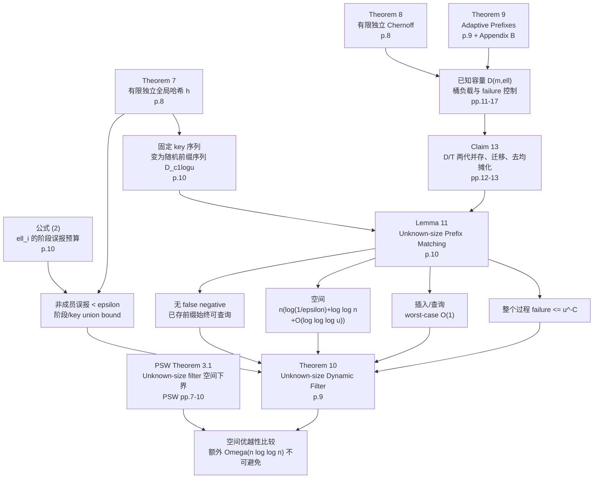

# Filter 主结果证明依赖图（Day 3，A 初稿）

负责人：刘威（A）  
用途：展示依赖关系，不替代各定理证明。节点后的页码指原论文印刷页码。

## 每条关键边的解释

1. Theorem 7 -> 随机前缀序列：全局有限独立哈希把任意给定插入 key 序列映射为 Lemma 11 要求的随机串分布。
2. Theorem 8 -> `D(m,ell)`：有限独立 Chernoff 控制主表 entry/subtable 负载，支撑第 5 节 failure 界。
3. Theorem 9 -> `D(m,ell)`：adaptive prefixes/fingerprints 支持小 data block 的压缩定位和常数时间操作。
4. `D(m,ell)` -> Claim 13：Claim 13 把已知容量黑盒作为一代 `D_i`，用 `decrement/initialize/destroy` 渐进迁移。
5. Claim 13 -> Lemma 11：相邻两代 `D/T` 保证 unknown size 下仍只查询常数个结构，并把重建工作拆到连续插入。
6. 公式 (2) + Theorem 7 -> 误报界：两两独立给出单前缀碰撞概率 `2^{-ell_i}`，对阶段和 key 并合后小于 `epsilon`。
7. Lemma 11 -> 无漏报：无 failure 时 prefix matching 精确；插入成员的哈希前缀必然匹配其查询哈希串。
8. Lemma 11 -> 空间：代入 `ell_{ceil(log n)}` 后得到 Theorem 10 的主体空间；另加输入无关 `u^c` 位。
9. Lemma 11 -> 时间：查询四个相邻结构，插入执行常数轮底层常数时间调用。
10. Lemma 11 -> failure：每层 `D_i` 的失败概率为 `u^{-2C}`，再对至多 `log u` 层并合。
11. PSW Theorem 3.1 + Theorem 10 -> 空间优越性：PSW 用中间状态编码证明额外 `Omega(n log log n)` 不可避免；Theorem 10 的上界在 `epsilon=o(1)` 时匹配相应领先系数。

## 当前不能由图替代的证明缺口

- Claim 13 半开阶段区间与 `ceil(log n)` 的下标对齐；
- 字面常数 10 对黑盒 `O(m)` 隐藏常数的配平；
- 新旧结构迁移瞬间的位级空间峰值；
- PSW 下界不属于 Theorem 10 的正确性依赖链；其证明骨架已核查，详见 A 的下界笔记 §14。

---

## B 补注（2026-07-21）

1. **边 Claim 13 → Lemma 11**：控制流（`i★`、四结构查询、10 轮维护、短/长串去向）已核实；**存储归纳**依赖的半开区间句与 `i★` 冲突，见 `discussions/issues/issue-stage-index.md`。画图时勿把该边读成“不变式已完全证明”。
2. **边 Lemma 11 → 时间**：Insert 的 O(1) 还依赖“常数轮维护在阶段内配平”；字面 10 见 `discussions/issues/issue-constant-10.md`。
3. **组件级展开**：`notes/memberB/core-components.md`、`figures/architecture.md`。
4. **ε vs δ**：误报率与 failure 概率是两条边（FP 子图 vs FL 子图），不要合并解释。
